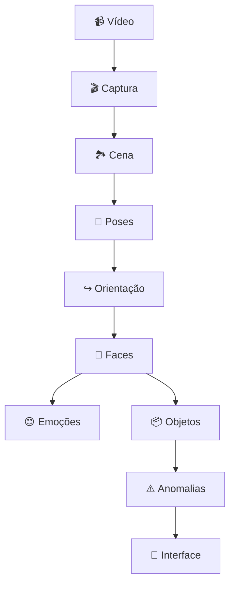

# Tech Challenge - Fase 4: Análise de Vídeo com IA

Este projeto consiste em uma aplicação desktop avançada para análise inteligente de vídeos, desenvolvida como parte do Tech Challenge (Fase 4). A solução utiliza técnicas modernas de Visão Computacional e Inteligência Artificial para extrair insights comportamentais, contextuais e emocionais de arquivos de vídeo.

## 🎯 Objetivo

O objetivo principal é processar vídeos de vigilância ou monitoramento para identificar e rastrear pessoas, analisar suas atividades e emoções, entender o contexto do ambiente (cena) e detectar anomalias (comportamentos suspeitos ou objetos fora de contexto).

## 🚀 Funcionalidades Principais

* **Detecção e Rastreamento de Atividades**: Utiliza **YOLO11-pose** para identificar esqueletos e classificar ações (caminhando, correndo, sentado, acenando, etc.).
* **Análise de Emoções**: Integração com **DeepFace** para análise facial profunda, identificando emoções como alegria, tristeza, raiva, surpresa, etc.
* **Detecção de Pessoas Deitadas (Oriented Object Detection)**: Uso inovador do **YOLO11-obb** (Oriented Bounding Box) para distinguir com precisão entre pessoas em pé e deitadas, crucial para detecção de quedas ou acidentes.
* **Classificação de Cena (Context Awareness)**: O sistema utiliza **YOLO11-cls** para identificar o ambiente (ex: escritório, sala de estar, parque), permitindo validações contextuais.
* **Detecção de Objetos Contextual**: Identifica objetos na cena (**YOLO11**) e valida se são esperados ou anômalos para aquele ambiente (ex: uma cama em um escritório é uma anomalia).
* **Detecção de Anomalias**: Motor de regras que combina dados comportamentais e visuais para alertar sobre:
  * Movimentos bruscos.
  * Picos de emoção negativa.
  * Inatividade prolongada.
  * Inconsistências de cena (objetos proibidos).
* **Interface Gráfica Profissional**: Desenvolvida em **PyQt6**, com player de vídeo, gráficos em tempo real (PyQtCharts) e painéis de estatísticas.
* **Relatórios Automáticos**: Geração de relatórios em TXT com resumo das ocorrências.

## 🏗️ Arquitetura e Fluxo de Processamento

A aplicação segue uma arquitetura modular, onde uma Thread de Processamento (`ProcessorThreadQt`) orquestra a execução sequencial dos modelos de IA frame a frame, sem congelar a interface do usuário.

### Pipeline de Processamento

O fluxo de análise é executado sequencialmente para cada frame processado:



| Ordem | Módulo | Função Principal | Tecnologia |
| :---: | :--- | :--- | :--- |
| **1** | **SceneClassifier** | Identifica o contexto do ambiente (ex: "Escritório", "Parque") | YOLO11-cls |
| **2** | **OrientedDetector** | Detecta a orientação de pessoas (em pé vs. deitado) | YOLO11-obb |
| **3** | **ActivityDetector** | Extrai poses esqueléticas e classifica ações | YOLO11-pose |
| **4** | **FaceDetector** | Recorta rostos baseando-se na geometria do corpo | Heurística |
| **5** | **EmotionAnalyzer** | Analisa expressões faciais nos recortes | DeepFace |
| **6** | **ObjectDetector** | Detecta objetos e valida coerência com a cena | YOLO11-detect |
| **7** | **AnomalyDetector** | Aplica regras para identificar comportamentos suspeitos | Lógica |
| **8** | **Visualizer** | Renderiza anotações e atualiza os gráficos | OpenCV/Qt |

### Estrutura do Projeto

```text
TC-4/
├── gui_app.py              # Ponto de entrada da aplicação
├── requirements.txt        # Lista de dependências Python
├── input/                  # Diretório para vídeos de entrada
├── output/                 # Diretório para vídeos processados
├── reports/                # Relatórios gerados
├── models/                 # Pesos dos modelos YOLO e DeepFace
└── src/
    ├── config.py           # Configurações globais e regras de contexto
    ├── gui/                # Interface Gráfica (PyQt6)
    │   ├── main_window_qt.py
    │   └── threads/processor_thread_qt.py # Orquestrador do pipeline
    ├── activity_detector.py # Wrapper YOLO11-pose
    ├── emotion_analyzer.py  # Wrapper DeepFace
    ├── face_detector.py     # Lógica de extração facial
    ├── scene_classifier.py  # Wrapper YOLO11-cls
    ├── oriented_detector.py # Wrapper YOLO11-obb
    ├── object_detector.py   # Wrapper YOLO11-detect
    ├── anomaly_detector.py  # Motor de regras de anomalia
    └── visualizer.py        # Renderização visual (OpenCV/PIL)
```

## 🛠️ Instalação e Configuração

### Pré-requisitos

* **Python 3.10** ou superior (3.12 recomendado).
* **GPU NVIDIA** (Opcional, mas altamente recomendado para performance em tempo real). Drivers CUDA instalados.

### Passo a Passo

1. **Clone o repositório e navegue até a pasta:**

    ```bash
    git clone <url-do-repositorio>
    cd TC-4
    ```

2. **Crie e ative um ambiente virtual:**

    ```bash
    python3 -m venv .venv
    source .venv/bin/activate  # Linux/Mac
    # .venv\Scripts\activate   # Windows
    ```

3. **Instale as dependências:**

    ```bash
    pip install -r requirements.txt
    ```

    *Nota: A primeira execução baixará automaticamente os modelos YOLO (~100MB cada) e DeepFace.*

4. **Execute a aplicação:**

    ```bash
    python gui_app.py
    ```

## 📖 Como Usar

1. A interface abrirá automaticamente.
2. Clique no ícone de **"Abrir Arquivo"** (canto superior esquerdo) para selecionar um vídeo da pasta `input/`.
3. Ajuste as configurações se necessário (botão "Configurações"):
    * **Frame Skip**: Aumente para maior velocidade (ex: 2 ou 3).
    * **Device**: CPU ou CUDA (GPU).
4. Clique no botão **Play** (▶) para iniciar a análise.
5. Acompanhe os resultados em tempo real:
    * **Vídeo**: Visualização com anotações de bounding boxes e labels.
    * **Estatísticas**: Contadores de faces, anomalias e atividades.
    * **Gráficos**: Distribuição de emoções e atividades (abas na parte inferior).
6. Ao final, o vídeo processado será salvo na pasta `output/` e um relatório de texto em `reports/`.

## ⚙️ Configuração Técnica (`src/config.py`)

O arquivo `src/config.py` centraliza constantes importantes, como:

* `SCENE_CONTEXT_RULES`: Dicionário que define quais objetos são esperados ou anômalos em cada tipo de cena (escritório, casa, rua).
* `ANOMALY_THRESHOLDS`: Limiares de sensibilidade para detecção de anomalias.
* `EMOTION_THRESHOLDS`: Sensibilidade para cada tipo de emoção.

---
**Tech Challenge Fase 4 - Pós Tech Data Analytics**
